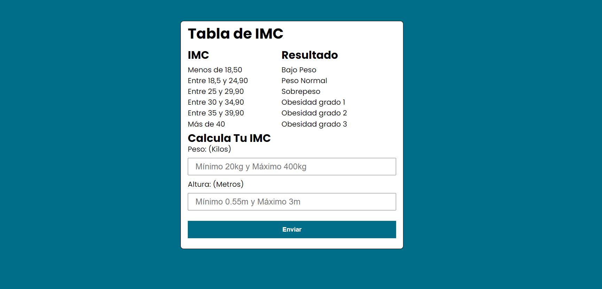

# Aplicación de Índice de Masa Corporal (IMC) 🔍

Esta aplicación ha sido desarrollada para facilitar el cálculo del Índice de Masa Corporal (IMC), proporcionando a los usuarios una herramienta sencilla y rápida para evaluar su salud relacionada con el peso. 💡

## Desarrollado por 👨‍💻

- **Andrés Sosa** 🚀
- **Cristian Acosta** 🌟

## Capturas de Pantalla 📸

Aquí puedes ver cómo luce nuestra aplicación en acción:

## Cómo Usar 📖

Instrucciones breves sobre cómo utilizar la aplicación, incluyendo cualquier requisito previo, cómo ejecutarla, y posibles argumentos de línea de comandos si es aplicable. 🛠️

## Contribuciones 🤝

Estamos abiertos a contribuciones. Si tienes alguna sugerencia para mejorar la aplicación o deseas reportar un error, no dudes en abrir un issue o realizar un pull request. 📝

## Licencia 📄

[MIT License](LICENSE.md) - Este proyecto está abierto a ser utilizado y modificado por cualquier persona interesada, siguiendo los términos y condiciones de la licencia MIT. 🔓
