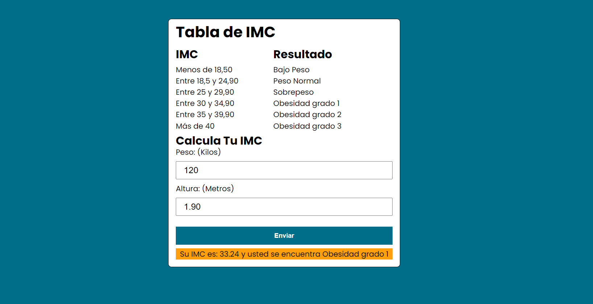

# Aplicación de Índice de Masa Corporal (IMC) 🔍

Esta aplicación ha sido desarrollada para facilitar el cálculo del Índice de Masa Corporal (IMC), proporcionando a los usuarios una herramienta sencilla y rápida para evaluar su salud relacionada con el peso. 💡

## Desarrollado por 👨‍💻

- **Andrés Sosa** 🚀
- **Cristian Acosta** 🌟

## Tecnologías Utilizadas 💻

Esta aplicación fue construida utilizando las siguientes tecnologías:

- **React**: Una biblioteca de JavaScript para construir interfaces de usuario.
- **JavaScript (JS)**: Lenguaje de programación utilizado para implementar la lógica compleja en el sitio web.
- **CSS**: Usado para diseñar y personalizar la apariencia de la aplicación.
- **SweetAlert2**: Una biblioteca de JavaScript que nos ayuda a la creación de alertas.

## Capturas de Pantalla 📸

Aquí puedes ver cómo luce nuestra aplicación en acción:





### Cómo Ejecutar la Aplicación 🚀

```bash
# Clonar el repositorio
git clone https://github.com/Andrewsy1004/App_Imc

# Dependiendo de cual de los dos projectos deseas ejecutar (con el patron aplicado o sin el patron aplicado)
cd ConExperto-Imc
npm run dev

cd SinExperto-IMC
npm run dev


